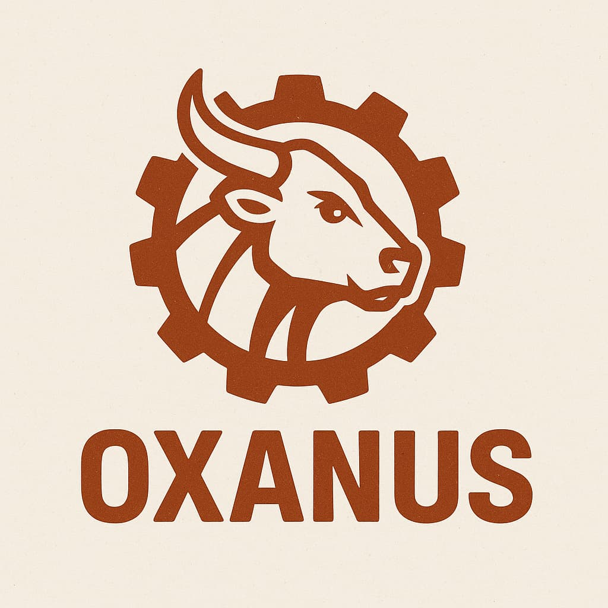

# Oxanus [](https://crates.io/crates/oxanus) [](https://github.com/oxanus/oxanus/actions)

<p align="center">
  <picture>
    
  </picture>
</p>

Oxanus is job processing library written in Rust that won't suck (or at least it will suck in a completely different way than other options). It is still very much work in progress.

## Features

- [x] Isolated Queues
- [x] Retrying
- [x] Scheduled Jobs
- [x] Dynamic Queues
- [x] Throttling (queue-based)
- [x] Unique Jobs
- [x] Resilient Jobs
- [x] Graceful Shutdown
- [x] Tests
- [x] Periodic Jobs
- [ ] Dev API
- [ ] Observability (prometheus)

## Dev

```bash
RUST_LOG=debug cargo run --example foo
```

